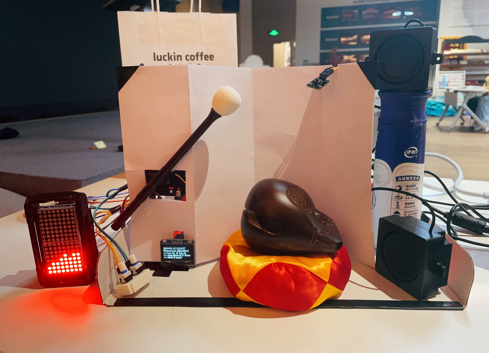
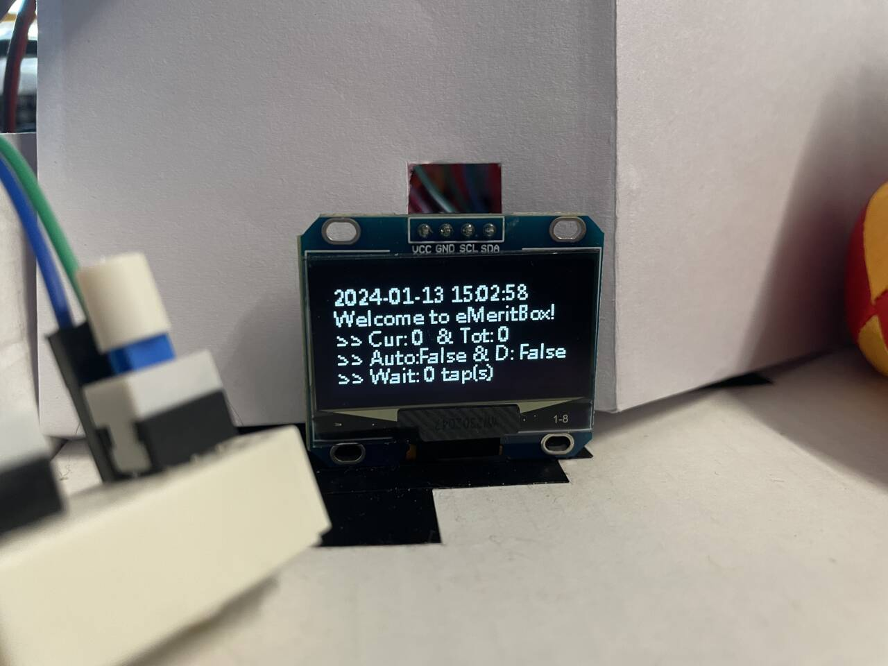
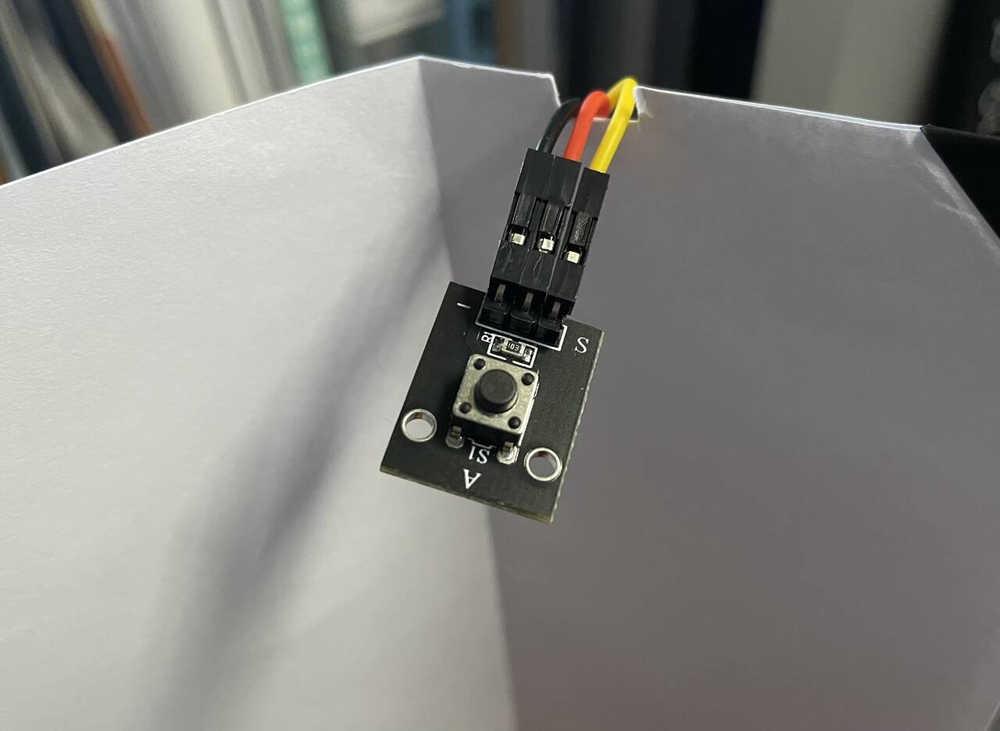

# eMeritBox

<table style="border-collapse: collapse; width: 100%;" border="0">
<tr>
<td style="width: 50%;">

> This proj is for a strange course...
>
> And the proj is also abstract...
>
> eMeritBox is like... 👉
>
> In fact, I just think the Microsystems course project should be done in a fun way to avoid being too boring...

</td>
<td style="width: 50%;">

</td>
</tr>
</table>

## Intro

暂时懒得写，先放点图图上来好了（

大合照👆

3D立体音箱！！！

小小OLED真可爱（

左边按钮控制音乐播放器，右边的控制自动敲击模式；

自动敲击关闭时，按键用以增加待敲击次数，消耗次数进行敲击；

长按可以连击，增加大量敲击次数；

自动敲击开启时，按键增加次数禁用，用以调整功德箱是否打开；

同时，自动敲击时，敲击不消耗次数。

每次敲击使功德箱内功德球+1，功德球可以感应重力随意移动；

功德箱打开时，功德球到达箱顶会掉出箱子，功德被捐献。

（没有做gif，放个功德飞飞好了...

然后有个网页端……呃，你可以多开好几个页面批量刷功德（会同步），之后把功德转换为实际敲击，做到刷功德敲木鱼一体化……

代码完全没整理……跑了，该复习了（QAQ

## Reference

### html

-> https://github.com/iissnan/iissnan.github.com

-> https://gitee.com/zeus10241024/dzmy

### respi(main_ctrl)

-> 之前在b站大学见过的电子沙漏（？
